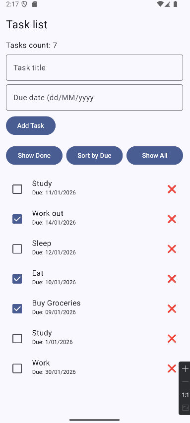

# ViewModel

This repository contains a simple **Android to-do list app** built with **Kotlin** and **Jetpack Compose**.  
Users can **view tasks, add new tasks, mark tasks as done, delete them, filter, and sort tasks by due date**.

---

## Features

- Display a list of tasks
- **Add new tasks** give it a title and a due date
- **Mark tasks as done** (only undone tasks can be marked) from checkbox
- **Delete task** by pressing the emote X next to the task
- **Filter tasks** to show only completed ones (Show Done Button) 
- **Sort tasks** by due date (Sort by Due Button)
- **Reset the task list** to show the initial task list (Show All Button)

---

## Data Model and Functions

### Data class (Task.kt)
```
data class Task(
    val id: Int,
    val title: String,
    val description: String,
    val priority: Int,
    val dueDate: String,
    val done: Boolean
)
```
- id → Unique identifier of the task
- title → Short task name
- description → Additional details
- priority → Task priority (1 = low, 2 = medium, etc.)
- dueDate → String representing the deadline
- done → Whether the task is completed

### Functions (TaskFunctions.kt):
```
fun addTask(list: List<Task>, task: Task): List<Task> { return list + task }

fun toggleDone(list: List<Task>, id: Int): List<Task> {
    return list.map { task ->
        if (task.id == id) { task.copy(done = !task.done) }
        else { task }
    }
}

fun filterByDone(list: List<Task>, done: Boolean): List<Task> {
    return list.filter { task ->
        task.done == done
    }
}

fun sortByDueDate(list: List<Task>): List<Task> {
    return list.sortedBy { task ->
        task.dueDate
    }
}

fun removeTask(list: List<Task>, id: Int): List<Task> {
    return list.filterNot { task -> task.id == id }
}
```

- addTask(list: List<Task>, task: Task): List<Task> → Adds a new task to the list
- toggleDone(list: List<Task>, id: Int): List<Task> → Toggles the done state of a task
- filterByDone(list: List<Task>, done: Boolean): List<Task> → Returns tasks that match the done state
- sortByDueDate(list: List<Task>): List<Task> → Sorts the tasks by dueDate
- removeTask(list: List<Task>, id: Int) : List<Task> → Deletes a task

---

## Screenshots

1. Updated version week2

    


---

## Dependencies

- Kotlin
- Jetpack Compose
- Material3
- AndroidX Libraries

---

## Future Improvement Ideas

- Edit task title, description, due date, and priority
- Sort by priority
- Change task colour by priority level, e.g. priority 1 = colour red
- Improve UI with colors, icons, and animations

---

## Compose State Managemen

Let's start by explaining what is State. State is any value that can change over time in an application, like a number, text, or a boolean. In Compose, state determines what the UI displays. 
When state changes, Compose automatically updates the UI to reflect the new state. This process is called recomposition.
 
`remember` is used to keep the state value across UI redraws so it doesn’t reset. 
**ViewModel** is usually used for larger state. It works with configuration changes (e.g. screen rotation) and separates UI logic from business logic, making the code more organized, maintainable, and reusable.. 

Instead of updating UI elements, you only change the state, and Compose updates the UI for you.

### Why ViewModel is better than just using remember?

To keep data safe, it is better to use a **ViewModel**. For example, if the user rotates their device, navigates between screens, changes the screen size, or uses multi-window mode, using only `remember` would cause the state and data to be lost. In contrast, a ViewModel preserves state across these configuration changes, keeping the data safe.

